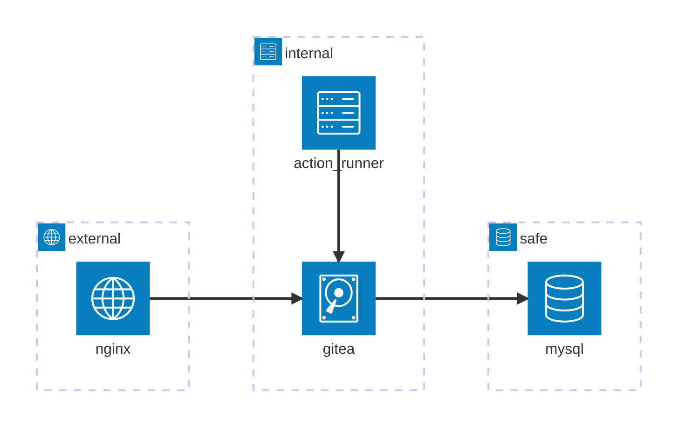
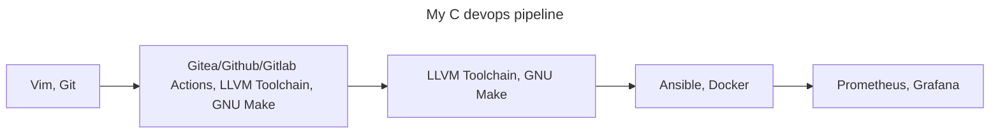

### This project aims to deploy the infrastructure described below with Ansible

### My final pipeline should look like this

To use this repo, you need to deploy the ssh servers provided in the directory *containers* (using docker)
You should then put the path to the private key in the inventory.yaml

